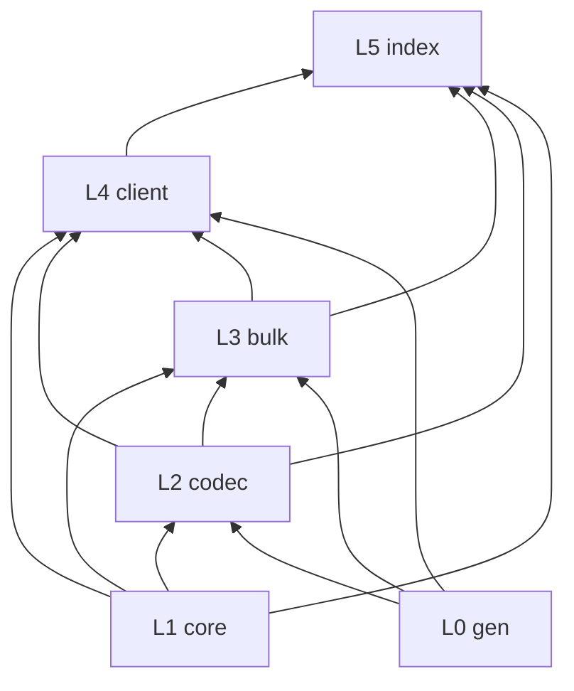

# GeoClaw 开发规范

## 1. 架构总览

### 1.1 设计原则

- **功能单一**：每个模块 / 类只做一件事，边界清晰，职责不重叠。
- **稳定优先**：模块 API 确定后尽量不变；变更走版本与 CHANGELOG，并补测试。
- **可独立验证**：任意模块应能 **脱离 HTTP、脱离上层编排** 单独实例化、单独测试、单独理解；上层只做组合，不承载底层算法。
- **单向依赖**：只允许「上层 → 下层」，禁止反向引用与循环依赖。
- **增量演进**：新问题在既有模块上补丁式解决；禁止为局部问题推倒已验证功能（详见 §10）。

### 1.2 单文件单对象

- **每个业务 `.ts` 文件只导出一个主类**（一个文件 = 一个对象职责）。
- 文件名与类名一致：`WebFetch.ts` → `class WebFetch`。
- 可附带 **类型定义**、**单例实例**（如 `export const webFetch = new WebFetch()`），但不得在同一文件再写第二个业务类。
- 生成代码目录 `src/gen/`、测试 `test/`、脚本 `scripts/` 不受此限。

### 1.3 目录与依赖层级

```
src/
  gen/           # L0 生成层：buf 输出，禁止手改
  core/          # L1 基础层：Logger、BytesLike（零业务、零 Rocktree）
  codec/         # L2 编解码层：字节 / URL / 路径 / flags / Protobuf
  bulk/          # L3 领域层：Bulk 元数据解析（纯内存，无 HTTP）
  fetch/         # L4 抓取层：WebFetch + TLS 浏览器指纹（node-wreq JA3/JA4/HTTP2）
  client/        # L5 接入层：Rocktree API（编排 fetch + codec + bulk）
  index.ts       # L6 门面：仅 re-export 与兼容函数，不含业务逻辑
```

**允许的 import 方向**（违反即禁止合并）：

| 模块 | 可依赖 | 禁止依赖 |
|------|--------|----------|
| `core/` | 无（或 Node 内置） | `codec/`、`bulk/`、`client/`、`gen/` |
| `codec/` | `core/`、`gen/` | `bulk/`、`client/` |
| `bulk/` | `core/`、`codec/`、`gen/` | `client/` |
| `client/` | `core/`、`codec/`、`bulk/`、`gen/` | — |
| `index.ts` | 全部 | 在门面内写算法或 HTTP |



### 1.4 模块职责清单（必须明确）

每个模块回答三个问题：**输入是什么、输出是什么、不做什么**。

#### L1 `core/` — 基础设施

| 文件 | 职责 | 输入 → 输出 | 不做 |
|------|------|-------------|------|
| `Logger.ts` | 分级日志 | 消息 + 可选 data → 控制台 | 业务判断、网络 |
| `BytesLike.ts` | 字节类型别名 | — | 编解码 |

**独立运行**：`new Logger("Test").info("ok")` 即可，无项目内 import。

#### L2 `codec/` — 编解码（无 I/O）

| 文件 | 职责 | 输入 → 输出 | 不做 |
|------|------|-------------|------|
| `GzipCodec.ts` | gzip 检测与解压/压缩 | `BytesLike` → `Uint8Array` | HTTP、Bulk 语义 |
| `ProtobufCodec.ts` | Protobuf 序列化/反序列化 | schema + bytes/message | URL、节点树 |
| `PbUrlCodec.ts` | BulkMetadata URL pb 参数 | path + bulkEpoch → `!1m2!1s…` | HTTP 请求 |
| `PathCodec.ts` | path_and_flags 位运算 | uint32 → path/level/flags | OBB、经纬度 |
| `FlagCodec.ts` | 节点 flags 位解码 | flags → 命名布尔字段 | HTTP |

**独立运行**：给定字节或数字即可单元测试，不依赖 `client/` 或网络。

#### L3 `bulk/` — Bulk 领域解析（纯内存）

| 文件 | 职责 | 输入 → 输出 | 不做 |
|------|------|-------------|------|
| `ObbParser.ts` | OBB 解包 | packed bytes + head + mpt → OBB | HTTP |
| `LatLonBox.ts` | 经纬度包围盒数据结构 | — | 编解码 |
| `LatLonBoxCodec.ts` | 八分体路径 → 经纬度盒 | octant path → LatLonBox | HTTP |
| `TextureMetadataParser.ts` | 纹理格式与 imagery epoch | flags + 字段 → 枚举/epoch | HTTP |
| `NodeHeaderParser.ts` | 单条 NodeMetadata → NodeHeader | BulkMetadata + NodeMetadata → NodeHeader | 批量索引 |
| `BulkDataParser.ts` | BulkMetadata → BulkData 索引 | BulkMetadata → nodes/octants/bulks | HTTP |

**独立运行**：`bulkDataParser.parse(decodeBulkMetadata(bytes))` 即可，无需 HTTP 客户端。

#### L4 `fetch/` — HTTP 抓取（通用，非 Rocktree）

| 文件 | 职责 | 输入 → 输出 | 不做 |
|------|------|-------------|------|
| `HostPinPool.ts` | 从 YAML 加载 IP 并轮询 `dns.hosts` 直连 | hostname + YAML → 单 IP pin | TLS 握手、HTTP 请求 |
| `HostPinRegistry.ts` | 按 URL 主机名解析对应 HostPin YAML | URL → HostPinPool / 系统 DNS | 发请求 |
| `TlsFingerprintCodec.ts` | 解析 node-wreq TLS 浏览器 profile 并合并附加请求头 | profile / context / overrides → browser + Headers | 原生 TLS 握手（由 node-wreq 负责） |
| `WebFetch.ts` | 带 TLS 指纹的 GET 字节拉取（默认 node-wreq） | URL + header 覆盖 → Uint8Array | Rocktree 业务、Bulk 解析 |
| `HotConnectionPool.ts` | 每 IP 一条 HTTP/2 热连接：预热、保活、下载、踢池 | IP 列表 + warmupUrl → 热连接 fetch | 业务 protobuf 解析 |
| `HotIpPicker.ts` | 热池公平选路（assignCount 均摊） | 候选列表 → IP | 连接管理 |
| `ColdConnectionPool.ts` | 403/429 等 IP 暂存，禁止下载直至预热成功 | status + IP → 冷池状态 | HTTP |
| `FetchTaskPool.ts` | 非阻塞任务池：失败回队、超时换 IP | URL 任务 → 最终响应 | 选路算法细节 |
| `FetchMetrics.ts` / `IpFetchStatsStore.ts` | 请求指标与按域名 IP 统计落盘 | attempt 事件 → 快照 / YAML | 地图渲染 |
| `IpGeoRegistry.ts` | IP → city/region/country 查表 | HostPin 记录 → IpGeoInfo | 网络 |
| `IpInfoClient.ts` / `FetchRouteResolver.ts` | ipinfo 查出口/目标坐标并解析航线 origin | token + IP → 坐标 / HostPinRecord | 地图绘制 |
| `FetchFlightPath.ts` | 飞行路线纯函数：航点、大圆/弹道弧、GeoJSON（无状态多 export） | 请求元数据 → FetchFlightPath / GeoJSON | HTTP |
| `FetchErrors.ts` | fetch 层 Error 子类聚合（允许同文件多 Error） | 构造参数 → Error | 业务逻辑 |
| `FetchTypes.ts` | 代理模式等共享类型与 `resolveProxyUrl` | mode + URL → 代理 URL | 连接池 |
| `createFetchMetricsFromConfig.ts` | 从 GeoClawConfig 装配指标/地理/统计 | — → 已配置实例 | 业务算法 |

**独立运行**：`webFetch.getBytes(url)` 即可；指纹与 header 通过构造选项或单次 `getOptions.headers` 配置。

#### L5 `client/` — Rocktree API

| 文件 | 职责 | 输入 → 输出 | 不做 |
|------|------|-------------|------|
| `RocktreeApi.ts` | 通过 WebFetch 请求 kh.google.com、解压、解码、可选 parse Bulk | URL 参数 → PlanetoidMetadata / BulkMetadata / BulkData | OBB 算法、flags 位定义、硬编码 User-Agent |

**独立运行**：需网络；HTTP 必须委托 `fetch/WebFetch`，算法必须委托 `codec/`、`bulk/`，不得在 client 内复制。

#### L0 `gen/` — 生成代码

- `rocktree_pb.ts`：Protobuf 类型与 schema，由 `buf generate` 生成。

#### L5 `index.ts` — 对外门面

- 仅 **re-export**、薄包装函数（向后兼容）。
- **禁止**新增业务逻辑、禁止直接 `fetch`、禁止解析算法。

### 1.5 模块化开发约束

1. **新增功能先定模块**：先写清「属于哪一层、哪个类」，再写代码；禁止为省事把逻辑堆进 `client/` 或 `index.ts`。
2. **跨模块只走 public API**：通过类实例 / 单例调用，禁止复制粘贴其他模块内部实现。
3. **每模块必有测试**：`test/<模块名>.test.ts` 或按领域拆分；纯函数 / 纯内存模块不得仅有 live 测试。
4. **可替换性**：`WebFetch` 的 `fetch`（node-wreq）、`tlsFingerprint` 与 `headerOverrides` 可注入；`RocktreeApi` 可注入 `webFetch`；编解码类不读全局环境（Logger 除外）。
5. **稳定接口**：public 方法签名变更视为破坏性变更，须 CHANGELOG + 版本 bump。

### 1.6 外部 YAML 配置（强制）

**所有可调运行时参数必须写在 `config/geoclaw.yaml`（或 `GEOCLAW_CONFIG` 指向的 YAML）中，禁止在 TypeScript 源码里硬编码默认值。**

| 配置段 | 用途 |
|--------|------|
| `log.level` | 全局日志级别 |
| `rocktree.baseUrl` | Rocktree API 根 URL |
| `fetch.*` | contextHeaders、超时、trace |
| `tls.*` | node-wreq browser profile |
| `proxy.*` | SOCKS5/HTTP 代理 URL 与 `auto/always/never` |
| `hostPin.*` | HostPin 域名、IP 列表 YAML、地址族 |
| `warmPool.*` | 热池运维：`concurrency`=预热/重热/保活；`taskConcurrency`=业务下载任务池 |
| `stressTest.*` | 测试脚本 `npm run stress:hot` 专用（与 `flight:map` 主服务无关） |
| `fetchMetrics.*` | 指标缓冲与 IP 统计落盘 |
| `fetchExport.*` | 进站成功后原样 PUT 出站存档（url/headers 与进站分离） |
| `fetchRoute.*` / `ipinfo.*` | 航线 origin 与 ipinfo |
| `flightMap.*` | 飞行地图服务与弧显示参数 |
| `benchmark.*` | `benchmark:kh-ips` 脚本默认值 |

- 代码通过 `GeoClawConfig.get()` 读取；构造选项 **仅用于测试注入或单次覆盖**，不得作为「第二套默认配置」。
- IP 列表等大文件放 `config/kh.google.com.yaml`，路径在 `hostPin.ipsFile` 引用。
- 测试使用 `test/fixtures/geoclaw.test.yaml`（`npm test` 已设置 `GEOCLAW_CONFIG`）。
- `build` 须 `cp -r config dist/config`，发布包携带配置模板。

## 2. TypeScript 标准（严格遵循）

编译配置以 `tsconfig.json` 为准，**不得弱化** `strict` 或相关选项。

### 2.1 编译器与模块

- `strict: true`（含 `strictNullChecks`、`noImplicitAny` 等全部子项）。
- `module` / `moduleResolution`: `NodeNext`；`verbatimModuleSyntax: true`。
- `isolatedModules: true`；`forceConsistentCasingInFileNames: true`。
- 仅 ESM（`"type": "module"`）；导入必须带 `.js` 扩展名（相对路径）。

### 2.2 类型纪律

- **禁止 `any`**；临时未知用 `unknown`，经类型守卫或 schema 解析后再用。
- **禁止 `@ts-ignore` / `@ts-expect-error`**（`src/gen/` 除外）。
- **禁止非空断言滥用**（`!`）；优先显式判空或早返回。
- 公共 API **必须** 导出必要类型（`export type`）；复杂返回值用命名 type/interface，禁止超长内联对象类型重复。
- 使用 **`import type`** 导入仅作类型使用的符号。
- 枚举优先使用 `gen/` 生成枚举；手写常量用 `as const` + union type。
- 函数 / 方法 **参数与返回值必须显式标注类型**（除简单箭头回调可由上下文推断且可读时）。

### 2.3 类与模块写法

- 类成员显式可见性：`public` / `private` / `readonly` 按需标注。
- 不可变数据用 `readonly`；集合若暴露只读视图，避免外部篡改内部状态。
- **禁止** `export default`（统一 named export，便于重构与 tree-shaking 一致）。
- 单例命名：类 `PascalCase`，实例 `camelCase`（如 `gzipCodec`）。
- 错误处理：预期失败抛明确 `Error` 消息；捕获后若向上抛，保留原因；用 Logger 记录 **error** 级别。

### 2.4 提交前 TypeScript 检查

```bash
npm run typecheck   # tsc --noEmit，必须通过
npm run build       # 生成 .d.ts，公共 API 类型必须完整
```

- 新增 public 方法未写 JSDoc → 视为未完成。
- 新增模块未在 §1.4 职责表（或 CHANGELOG）中可说明边界 → 先更新文档再合并。

## 3. JSDoc 注释（中文，扁平，输入/输出明确）

> 快速参考：[`docs/JSDOC.md`](docs/JSDOC.md)  
> 生成工具：`npm run jsdoc:gen` / `npm run jsdoc:check`

### 3.1 适用范围

每个 **public** 方法、**export** 函数、**public** 构造函数必须写 JSDoc。  
`private` 方法可选；`src/gen/` 除外。

### 3.2 标准格式（固定，不得改结构）

**一句摘要 + 扁平 `@param` + 单行 `@returns` + 可选 `@throws`**

```typescript
/**
 * 解包 path_and_flags 为路径与标志位。
 * @param pathAndFlags - 输入：`number` — NodeMetadata.path_and_flags（uint32）
 * @returns 输出：`UnpackedPathAndFlags` — path、level、flags 三字段
 */
```

| 标签 | 格式 | 示例 |
|------|------|------|
| 摘要 | 一句中文，≤40 字，句号结尾 | `解包 path_and_flags 为路径与标志位。` |
| `@param` | `输入：\`Type\` — 具体含义` | `输入：\`string\` — 绝对八分体路径` |
| `@returns` | `输出：\`Type\` — 具体含义` 或 `输出：无（\`void\`）` | `输出：\`BulkData\` — nodes/octants/bulks 索引` |
| `@throws` | `{Error} 条件` | `packed.length !== 15 时` |

### 3.3 类注释 vs 方法注释

| 位置 | 格式 | 禁止 |
|------|------|------|
| **类 / interface** | 一句 `/** ... */` 摘要，无 `@param` | Markdown 列表、写死 magic number（如 120/124/88） |
| **public 方法** | §3.2 完整 JSDoc | 冗长 `Message<"proto...">` 类型名 |
| **构造函数** | `@param` 即可；可不写 `@returns` | 与 §3.2 冲突的嵌套说明 |

类注释说明 **是什么**；方法 JSDoc 说明 **输入/输出类型与含义**。  
可验证数值（根 Bulk 节点数等）写在 **测试断言** 或 **DEVELOPMENT.md §6**，不写在类注释里。

### 3.4 禁止事项

- **含糊词**：等、相关、可能、一般、某种、若干、类似、适当
- **深层嵌套**：在 JSDoc 内写 `{ a: { b: … } }` 或多层字段列表
- **嵌套列表**：`-` / `•` 子项
- **超过 12 行** 的 JSDoc 块（应拆类型到 `export type`）

复杂返回值 **只引用类型名**：`输出：\`NodeHeader\` — 字段见 export type NodeHeader`。

### 3.5 类型字段

`export type` / `interface` 字段用单行注释：

```typescript
/** 绝对八分体路径；类型：`string` */
path: string;
```

### 3.6 快速生成

| 方式 | 命令 / 操作 |
|------|-------------|
| 编辑器片段 | `gcdoc` / `gcdoce` / `gcdocv`（`.vscode/geoclaw-jsdoc.code-snippets`） |
| 打印草稿 | `npm run jsdoc:gen` |
| 写入缺失 | `npm run jsdoc:gen -- --write` |
| 格式重写 | `npm run jsdoc:gen -- --write --force` |
| 提交校验 | `npm run jsdoc:check` |
| 导出 Markdown | `npm run jsdoc:md` → [`docs/API.md`](docs/API.md) |

CLI 从 TypeScript 类型推断 `@param` / `@returns` 的类型名；生成后须把「待补充」改为具体说明。

## 4. 日志规范

统一使用 `src/core/Logger.ts`，**禁止**直接 `console.log`（测试与 scripts 入口除外）。

| 方法 | 级别 | 用途 | 前缀 |
|------|------|------|------|
| `logger.debug()` | DEBUG | 开发调试：字节长度、URL、中间变量 | `[DEBUG]` |
| `logger.info()` | INFO | 正常业务流程：请求成功、解析统计 | `[INFO]` |
| `logger.warn()` | WARN | 可恢复异常：缺字段回退、HTTP 重试 | `[WARN]` |
| `logger.error()` | ERROR | 失败：HTTP 非 2xx、解码失败、抛错前 | `[ERROR]` |

格式：`[级别] [类名] 消息`，可选结构化 data。每个业务类使用 **静态** Logger：`private static readonly logger = new Logger("ClassName")`，全类共享、scope 仍为类名。

环境变量：`GEOCLAW_LOG_LEVEL` = `debug` | `info` | `warn` | `error` | `silent`（默认 `info`）。

### 4.1 DEBUG 耗时追踪（强制）

每个业务对象的 **public 方法**（及关键 private I/O）必须用 `Logger.measureSync` / `measureAsync` 包裹，以便 DEBUG 模式下定位卡点。

| API | 用途 |
|-----|------|
| `logger.measureSync(name, fn, context?)` | 同步方法计时 |
| `logger.measureAsync(name, fn, context?)` | 异步方法计时 |

**输出格式**（仅 `GEOCLAW_LOG_LEVEL=debug` 时）：

```
[DEBUG] [PathCodec] 耗时 unpackPathAndFlags { durationMs: 0.012, pathAndFlags: 12345 }
```

规则：

- `name` 与方法名一致，便于日志检索
- `context` 放 **真实输入关键字段**（path、flags、url、字节长度），禁止空对象
- 非 DEBUG 级别 **零额外开销**（直接执行 fn，不计时）
- 禁止手写 `console.time` / `Date.now` 分散计时；统一走 Logger
- 新增类必须：`private static readonly logger = new Logger("ClassName")`，方法内用 `ClassName.logger`；所有 **有业务副作用或 I/O 的** public 方法须 measure 包裹
- **例外（可省略 measure）**：纯状态查询 getter（如 `size` / `isCold` / `getColdCount` / `pendingCount` / `getWebFetch`）；`Error` 子类构造函数；`export type` 与无状态纯函数模块（如 `FetchFlightPath.ts` 几何函数）
- **例外（Logger）**：`FetchErrors.ts` 的 Error 子类、纯类型文件 `FetchTypes.ts` 可不建 Logger

调试示例：

```bash
GEOCLAW_LOG_LEVEL=debug npm run fetch:bulk
GEOCLAW_LOG_LEVEL=debug npm test -- test/bulk-data.test.ts
```

分析日志：按 `durationMs` 降序查看 `[ClassName] 耗时` 行，定位最慢对象与方法；结合同条 `context` 复现真实输入。

## 5. epoch 命名

| 名称 | 含义 | 用途 |
|------|------|------|
| `bulkEpoch` | Bulk 版本 | `BulkMetadata/pb=!2u{bulkEpoch}`，仅 `isBulk` 节点 |
| `epoch` | 节点版本 | `NodeData/pb=!2u{epoch}` |
| `imageryEpoch` | 影像版本 | flags 含 `USE_IMAGERY_EPOCH` 时 `!3u{imageryEpoch}` |

## 6. Bulk 节点集合

| 集合 | 条件 | 根 Bulk 典型数量 |
|------|------|------------------|
| `nodes` | `canHaveData && obb` | 120 |
| `octants` | `(canHaveData \|\| !LEAF) && obb` | 124 |
| `bulks` | `isBulk` | 88 |

## 7. 调试与测试（真实数据强制）

### 7.1 TypeScript 调试规范

调试必须 **严格遵循 TypeScript 类型与编译器**，禁止用「绕过类型」的方式掩盖问题。

| 要求 | 说明 |
|------|------|
| **根因优先** | 先定位类型错误 / 运行时错误的真实原因，禁止 `any`、`@ts-ignore`、强转糊弄 |
| **分级日志** | 库内用 `Logger.debug`（`GEOCLAW_LOG_LEVEL=debug`），禁止在 `src/` 用 `console.log` 代替 |
| **可复现输入** | 调试时必须记录 **真实输入**（URL、epoch、字节长度、fixture 文件名），不得凭记忆猜测 |
| **耗时追踪** | DEBUG 下每个对象 public 方法须输出 `耗时 {method}` + `durationMs`（见 §4.1） |
| **最小复现** | 用 `scripts/fetch-*.ts` 或 fixture 复现；禁止改测试断言让「假数据」通过 |
| **调试隔离** | 临时调试代码不得合入 `main`；合入前删除 `debugger`、临时代码 |

推荐命令：

```bash
GEOCLAW_LOG_LEVEL=debug npm run fetch:planetoid
GEOCLAW_LOG_LEVEL=debug npm run fetch:bulk
GEOCLAW_LOG_LEVEL=debug npm test -- test/bulk-data.test.ts
node --inspect-brk ./node_modules/tsx/dist/cli.mjs --test test/bulk-data.test.ts
```

### 7.2 真实数据测试（强制，禁止假数据）

**每个函数的测试必须使用真实数据。** 下列做法 **一律禁止**：

- 手写「看起来合理」的 protobuf 对象 / 字节，用来断言业务逻辑正确
- 用 **猜测的** flags、节点数、epoch、OBB 等期望值，无真实来源
- Mock `fetch` 返回自编字节，冒充线上响应
- 为让测试变绿而 **修改断言** 或 **降低断言精度**
- 没有数据时 **自行编造** 预期结果；必须 **向维护者索要或自行拉取真实数据**

**允许的数据来源（须可追溯）：**

| 来源 | 说明 | 存放 |
|------|------|------|
| **线上拉取** | `https://kh.google.com/rt/earth/...` | `*-live.test.ts` 运行时拉取 |
| **Fixture 固化** | 用脚本从线上捕获后落盘 | `test/fixtures/` + `manifest.json` |
| **可验证推导** | 仅 codec 层位运算，输入来自 fixture 中某字段的 **真实 uint32** | 测试注释须写明 fixture 路径与字段 |

Fixture 必须记录 **来源**（URL、path、bulkEpoch、捕获日期）。见 [`test/fixtures/README.md`](test/fixtures/README.md)。

### 7.3 测试文件分类

| 类型 | 命名 | 数据 | 用途 |
|------|------|------|------|
| **Live** | `*-live.test.ts` | 运行时从 kh.google.com 拉取 | 端到端、Bulk 解析、客户端 |
| **Fixture** | `*.fixture.test.ts` | `test/fixtures/` 真实字节/JSON | 离线可重复、CI 可跑 |
| **禁止** | 纯合成 roundtrip 作为 **业务正确性** 依据 | 手写 create() 消息 | 不得用于 bulk/flags/path 等领域断言 |

> **说明**：`test/codec.test.ts` 等仅验证 **编解码器不丢字段** 的合成 roundtrip，**不能**替代 Rocktree 领域函数的真实数据测试；领域行为必须以 live 或 fixture 为准。

### 7.4 无真实数据时的流程

1. **停止** — 不写猜测型测试、不提交「假绿」用例  
2. **索取或捕获** — 运行 `npm run fetch:planetoid` / `fetch:bulk`，或请维护者提供字节样本  
3. **落盘** — 写入 `test/fixtures/` 并更新 `manifest.json`  
4. **再写测试** — 断言必须引用 manifest 中的来源说明  

### 7.5 脚本

- `scripts/` 仅 CLI 入口；捕获逻辑可复用 `src/` 对象  
- 新增捕获脚本时，输出必须可写入 fixture（hex/base64/原始 `.bin`）

### 7.6 禁止事项（调试 / 测试）

- 用假数据 / 猜想让测试通过  
- 无 fixture 来源注释的 magic number 断言（如单独的 `18`、`19` 无 bulk 样本引用）  
- 删除或 skip 失败的 live 测试而不修复  
- 调试时关闭 `strict` 或永久保留 `@ts-expect-error`  
- 将 mock 数据当作 Rocktree 行为标准  

## 8. 禁止事项

- 手改 `src/gen/rocktree_pb.ts`
- 在库代码中使用 `console.log` 代替 Logger
- 一个文件多个业务类
- 无注释的 public 方法
- **下层 import 上层**（如 `codec/` import `bulk/`）
- **循环依赖**
- 在 `client/` 或 `index.ts` 实现编解码 / 解析算法
- 使用 `any`、`@ts-ignore`（`gen/` 除外）
- `export default`
- 模块无对应测试却标记为「稳定」
- **为修小问题整模块重写或删除已验证实现**（见 §10）
- **未跑 typecheck / test / jsdoc:check 即提交**（见 §10.4）
- **用假数据 / 猜测预期让测试通过**（见 §7.2）

## 9. GitHub 版本管理

本项目 **必须** 使用 GitHub 管理源码与版本历史（禁止仅在本地维护、不上传远程）。

### 9.1 版本号规则

- **初始版本**：`0.0.1`（`package.json` 的 `version` 字段为唯一权威来源）。
- **每次提交**：补丁位（最小位）**+1**，即 `0.0.1` → `0.0.2` → `0.0.3` …
- 不在常规提交中递增次版本或主版本；仅在项目明确发布里程碑时另行约定（须更新本节并记录于 CHANGELOG）。

### 9.2 CHANGELOG 对齐（强制）

根目录 [`CHANGELOG.md`](CHANGELOG.md) 与 **每一次** git 提交必须一致：

1. 提交前在 `CHANGELOG.md` 顶部 `## [未发布]` 下写好本次变更条目（新增 / 变更 / 修复 / 移除）。
2. 将 `package.json` 的 `version`  bump 至新版本号（补丁 +1）。
3. 把 `## [未发布]` 中的内容 **移动** 为 `## [x.y.z] - YYYY-MM-DD` 区块（日期为提交日）。
4. 清空 `## [未发布]`，留作下次草稿区。
5. **同一提交** 内必须同时包含：业务代码变更 + `CHANGELOG.md` + `package.json` version。

禁止：版本号已升但 CHANGELOG 未写；CHANGELOG 已写但 `package.json` 未改；分两次提交分别改版本与日志。

### 9.3 CHANGELOG 写法

- 语言：中文（类别标题可保留英文：Added / Changed / Fixed / Removed，或中文：新增 / 变更 / 修复 / 移除）。
- 每条说明 **用户可感知** 的变更，而非内部重构细节堆砌。
- 关联 issue/PR 时可附 `(#123)`。

示例（提交前草稿在 `[未发布]`）：

```markdown
## [未发布]

### 新增
- NodeData 拉取与 mesh 字节解码

### 修复
- BulkMetadata gzip 边界检测
```

提交时变为：

```markdown
## [未发布]

## [0.0.2] - 2026-09-03

### 新增
- NodeData 拉取与 mesh 字节解码

### 修复
- BulkMetadata gzip 边界检测
```

### 9.4 Git 提交信息

- 第一行：简短中文或英文摘要（≤72 字符）。
- 正文（可选）：与 CHANGELOG 条目一致，说明原因与影响。
- 推荐格式：`release: v0.0.2 — 简短描述` 或 `feat: 简短描述 (v0.0.2)`，**必须** 含版本号或可在正文注明 `Version: 0.0.2`。

### 9.5 分支与标签

- 默认分支：`main`。
- 每次版本提交在 GitHub 打 **annotated tag**：`v0.0.1`、`v0.0.2` …，与 `package.json` / CHANGELOG 版本一致。
- Tag 消息与对应 CHANGELOG 区块标题相同。

### 9.6 提交检查清单

每次 `git commit` 前确认：

- [ ] `npm run typecheck` 通过
- [ ] `npm test` 通过（且未用假数据/猜测预期凑数，见 §7）
- [ ] `npm run jsdoc:check` 通过
- [ ] **既有功能未回归破坏**（见 §10.4）
- [ ] `package.json` version 已 +1
- [ ] `CHANGELOG.md` 已写入新版本区块且 `[未发布]` 已清空
- [ ] 版本号在三处一致：`package.json`、`CHANGELOG.md` 标题、（若打 tag）`vX.Y.Z`

### 9.7 禁止事项（版本）

- 提交时不更新 CHANGELOG
- 提交时不 bump `package.json` version
- CHANGELOG 版本与 `package.json` 不一致
- 跳过 GitHub 远程仅本地 commit（须配置 `origin` 并 push）

## 10. AI 辅助开发（全局思考、禁止破坏既有功能）

本节约束 **人类开发者与 AI 助手**（Cursor Agent 等）在本项目中的协作方式。  
目标：**每次新问题都是增量演进，而不是推倒重来；修小问题不得破坏已验证功能。**

### 10.1 核心原则

| 原则 | 要求 |
|------|------|
| **全局思考** | 先理解整体架构（§1）、模块边界（§1.4）、已有测试与 CHANGELOG，再动手 |
| **增量修改** | 在现有代码上 **最小必要变更** 解决问题，禁止无关重写 |
| **功能守恒** | 已发布 / 已测试通过的行为视为 **契约**；无明确授权不得破坏 |
| **验证闭环** | 未跑通检查命令前，不得声称「已完成」或「已修复」 |

### 10.2 接到新问题时的固定流程

1. **读上下文**：`DEVELOPMENT.md`、相关 `src/` 模块、对应 `test/`、近期 `CHANGELOG.md`。
2. **定影响面**：列出会触动的文件与 **可能受影响的已有功能**（含对外 API、`index.ts` 兼容层）。
3. **选策略**：优先 **补丁式修复** 或 **在正确模块层新增**；禁止为省事把逻辑堆进 `client/` / `index.ts`。
4. **最小 diff**：只改与问题直接相关的代码；不顺手重构、不改无关命名、不搬目录。
5. **全量验证**（§10.4）通过后，再更新 CHANGELOG 与版本。

**禁止**：把每个新问题都当成「重新做一个功能」——不得删除或整文件替换已稳定模块，除非用户 **明确要求** 重构且接受回归风险。

### 10.3 变更范围纪律

**允许：**

- 修复 bug 所需的最少行数变更
- 在 **正确分层** 下新增类 / 方法 / 测试
- 为兼容保留 `index.ts` 薄包装（不删旧导出，除非 CHANGELOG 标注移除）

**不允许：**

- 为修一个小问题 **重写** codec / bulk / client 整模块
- 删除已通过测试的代码路径而未补等价实现与测试
- 修改 `BulkData` 计数语义、epoch 命名、模块依赖方向等 **已写入规范的契约**
- 扩大 scope：用户只问 A，却顺带改 B、C、D
- 未运行测试就删除「看起来多余」的旧文件

### 10.4 回归验证（强制，不可跳过）

任何代码变更完成后，**必须全部通过**：

```bash
npm run typecheck
npm run jsdoc:check
npm test
```

附加要求：

- 领域函数测试须基于 **真实数据**（live 或 fixture，见 §7.2）；禁止新增纯合成数据冒充线上行为。
- 若改动 `bulk/`、`codec/`、`client/`：确认 **根 Bulk 仍满足** nodes=120、octants=124（见 `test/bulk-data.test.ts`，数据来自 kh.google.com）。
- 若改动公开 API：确认 `src/index.ts` 向后兼容导出仍可用。
- 若仅改文档 / 规则：至少 `npm run typecheck` 仍应通过（无代码则测试可省略）。

**任一失败即视为引入回归，必须修复后再提交。** 不得用「先合再修」绕过。

### 10.5 AI 助手专用约束（Cursor / Agent）

- **先读后改**：修改 `src/` 前必须先阅读目标文件及调用方；禁止凭猜测重写。
- **单任务聚焦**：一次对话解决一个问题；不主动发起大规模重构。
- **保留稳定面**：已存在的单例（如 `gzipCodec`）、测试用例、线上 live 测试 **不得随意删除**。
- **说明影响**：回复中简要说明「改了什么、未改什么、如何证明未破坏旧功能」。
- **规则优先**：与本节冲突的用户临时指令，应先指出风险再执行；涉及破坏性变更须用户确认。

### 10.6 禁止事项（AI / 变更）

- 因局部问题 **整模块重写** 或 **批量删除** 旧实现
- 破坏已有测试使其通过删测试而非修代码
- 修改与问题无关的文件并混入同一提交
- 跳过验证声称完成
- 破坏 `CHANGELOG` / 版本对齐规则（§9）
- 破坏模块化分层（§1.3）或 JSDoc 标准（§3）
- **未获用户点名就主动加限制参数 / 限流门禁**（见 §10.8）

### 10.7 回归破坏时的处理

1. 立即回滚或最小修复，恢复测试通过。
2. 在 CHANGELOG **修复** 条目记录回归与修复。
3. 若根因是架构误解，更新 §1 / §10 说明，避免重复发生。

### 10.8 禁止主动加限制（用户未点名则不加）

**原则：需要限制时，由用户明确要求再加。禁止「上来就做很多限制」——这是烦人且错误的默认行为。**

| 禁止（未获用户明确要求） | 说明 |
|--------------------------|------|
| 拆更多并发上限 | 如再拆 reheat / keepAlive / task 等更小 cap |
| 人为长退避 / 冷却 | 如默认 30s/60s 才允许重试 |
| 硬门槛 | 如「热池至少 N 条才继续」 |
| 强必填校验风暴 | 把大量 YAML 字段改成缺一崩溃 |
| 预防性配额 / TopN / 次数封顶 | 「为了稳健」顺手阉割能力 |

**允许：**

- 用户 **明确说**「加这个限制 / 这个上限 / 这个退避」时，按要求加，不过度发挥
- 实现功能或修 bug 所必需的最少逻辑（不是预防性限流）
- 给配置写清注释（说明用途 ≠ 增加限制）

**做错时：** 立刻撤回多余限制，恢复简单可用路径；不要用「为了安全/稳健」辩解。

Cursor 规则文件：`.cursor/rules/geoclaw-no-premature-limits.mdc`（`alwaysApply: true`）。
